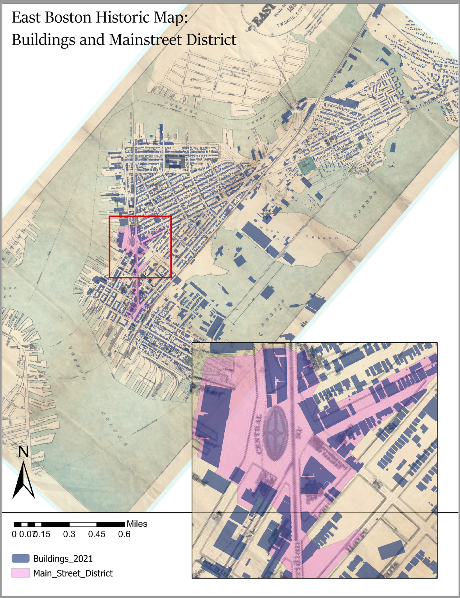
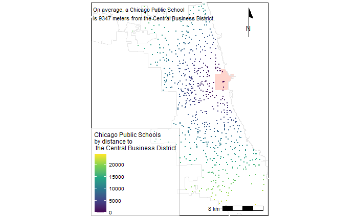
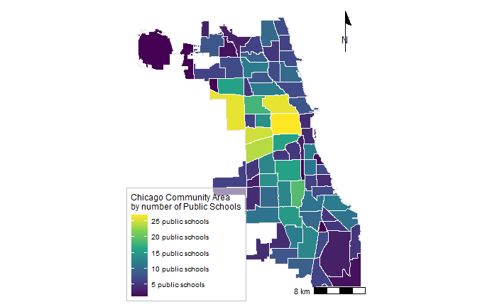
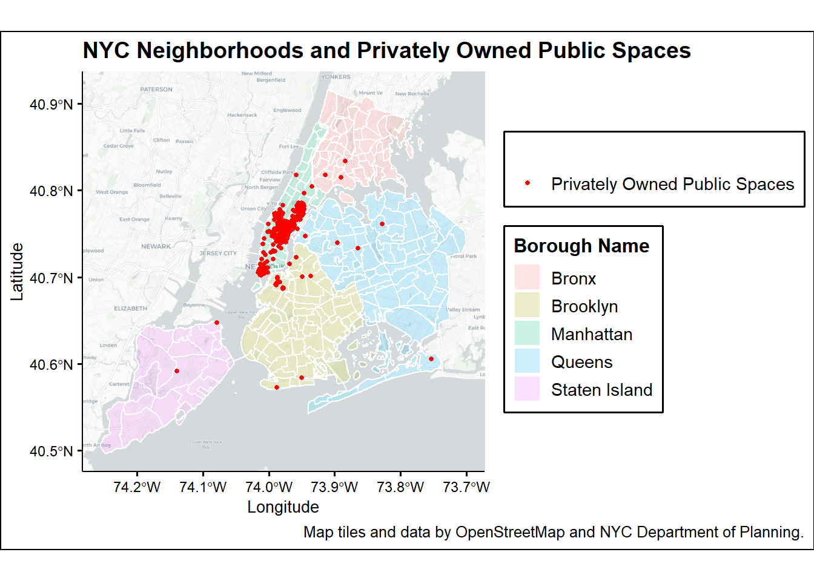
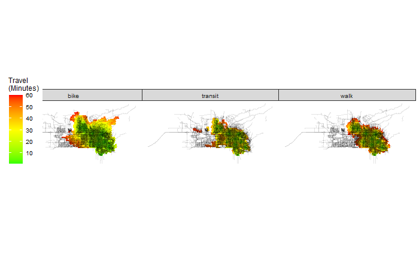
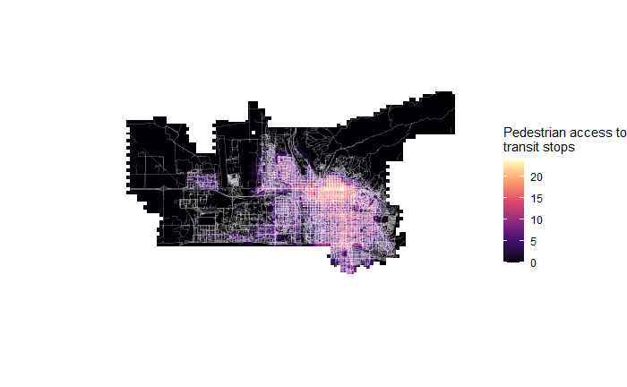
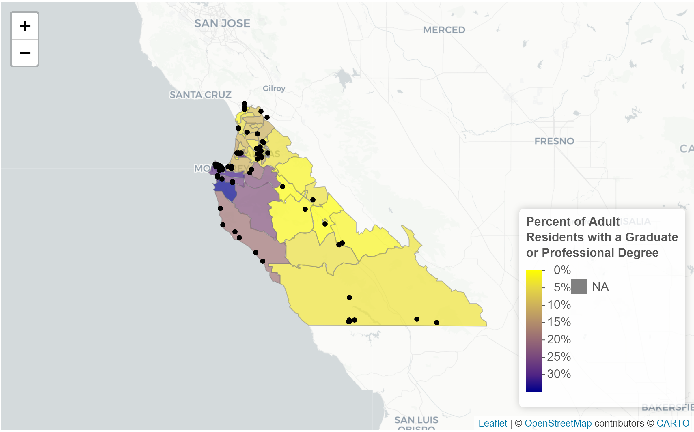

```{r setup, include=FALSE}
knitr::opts_chunk$set(echo = TRUE)
```

# Introduction

This portfolio demonstrates proficiency in spatial analysis using Rstudio. Datasets were taken from municipal government sources provided by cities across the U.S., and represent a variety of themes, from historic agglomeration to travel times to education levels.

# Boston, Massachusetts

## Georeferenced Historic Map of East Boston

This map displays a georeferenced raster image of East Boston from 1880. This area has seen dramatic changes in land geography over the last 140 years. East Boston was originally a series of islands, which then was filled in with man-made land to support additional infrastructure. I compared 1880 East Boston to 2021 datasets representing buildings and main street district, showing the permanence of agglomeration patterns in the built environment and development patterns.

This map demonstrates the following skills: 

* Georeferencing a raster image

[](fullsize/Historic_EB.pdf){target="_blank"}

# Chicago, Illinois

## Average Distance of Public Schools to Central Business District

This map calculates the average distance of Chicago's public schools to the City's central business district. This graphic might be helpful in considering that the majority of jobs are concentrated in the city center, which in turn impacts travel patterns and trip chaining of working parents with children attending public school.

This map demonstrates the following skills:

* Calculating and displaying relationships among point and polygon layers based on distance

[](fullsize/Chic_av_dist.pdf){target="_blank"}

## Community Areas by number of Public Schools

Chicago is divided into 77 community areas. These areas are tied to census and statistical data to assist local leaders in urban planning and policy decisions. The below choropleth map displays these community areas by the number of public schools contained within each polygon. This information may useful in visualizing population distribution, commuting distances for students, and gaps in the local school network.

This map demonstrates the following skills:

* Aggregating point data to a layer of polygons

[](fullsize/Chic_pt2poly.pdf){target="_blank"}

# New York City, New York

## Privately Owned Public Spaces

This map displays the distribution of privately owned public spaces (or pops) throughout New York City in relation to neighborhood boundaries. Analyzing this distribution helps to represent access to public gathering space, as well as gaps in accessibility.

This map demonstrates the following skills:

* Displaying multiple vector layers on the same map

[](fullsize/NY_pops.pdf){target="_blank"}

# Salt Lake City, Utah

## Travel Time Analysis

The following facet wrap compares travel time to pharmacies in Salt Lake City via different active transportation modes (public transit, biking, and walking). Pharmacies represent access to regular care for many people living with chronic conditions (diabetes, heart disease, arthritis, etc.) and should be locally accessible.

This map demonstrates the following skills:

* Calculating and displaying accessibility, based on travel time

[](fullsize/SLC_tt.pdf){target="_blank"}

## Accessibility Raster

The Salt Lake area has historically been heavily car-dependent. However, when the City hosted the winter Olympics in 2002, local leaders prioritized rapid expansion and improvement of local public transportation. Since then, the Utah Transit Authority has continued to place a high priority on transit accessibility. This shows accessibility based on a distance-decay function of the walking time to the nearest transit stop.

This map demonstrates the following skills:

* Displaying raster data on a map
* Converting between raster layers and vector layers

[](fullsize/SLC_Accessibility.pdf){target="_blank"}

# Monterey, California

## Interactive Map - Education Level and Schools

This map displays the percentage of the population of Monterey county, California, holding a graduate or professional degree, according to American Community Survey estimates from 2019. This data is overlaid with school locations displayed as point data. This map shows a strong correlation between higher education levels and proximity to Monterey City center, likely owing to the higher land values in the city, which tend to be less affordable for those with lower education levels.

This map demonstrates the following skills: 

* Displaying data on an interactive map

[](fullsize/Monterey.html){target="_blank"}